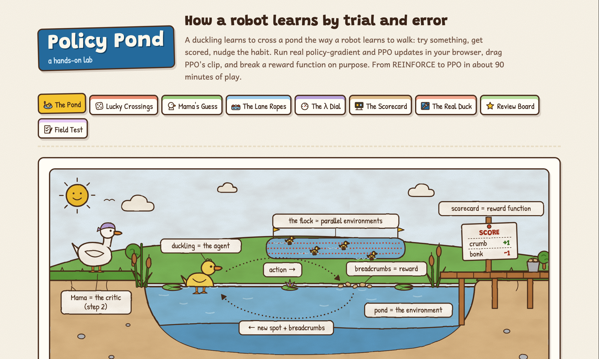
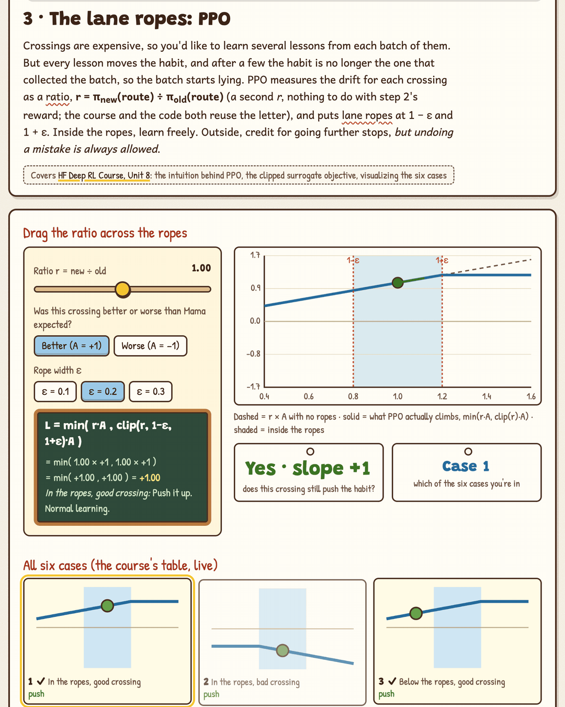
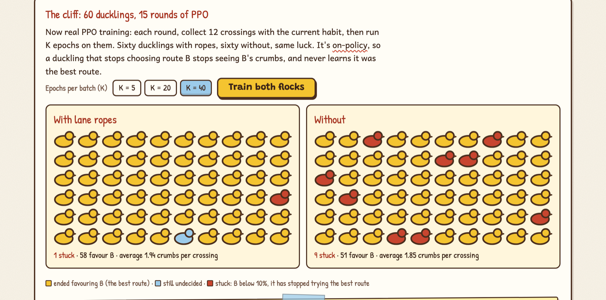

# Policy Pond

**A hands-on lab for how robots learn by trial and error.** Run real policy-gradient and PPO updates in your browser, drag PPO's clip across its limits, dial GAE's λ, and break a robot's reward function on purpose.

**Play it: https://bakulbadwal.github.io/policy-pond/**

*Step 3 in motion: drag the ratio past a rope and the push stops (case 5); drag it back below the ropes and the push is allowed again (case 3). The ropes cap good news, never bad news.*

A duckling learns to cross a pond the way a robot learns to walk. The **duckling** is the agent and its habits are the **policy**, the **pond** is the environment, and **breadcrumbs** are the reward. **Mama Duck** is the critic, who knows what a crossing usually earns. The **lane ropes** are PPO's clip, and the **scorecard** is the reward function you write. Hold that picture and the rest of deep RL follows, from REINFORCE to PPO.

## What's inside

| Step | You play with | What clicks |
|---|---|---|
| **0 · The Pond** | One crossing, step by step, with the (state, action, reward, next state) log a training loop records; a γ dial with the horizon in steps and seconds | Return and discounting; γ = 0.99 at 50 Hz means "about 2 seconds ahead" |
| **1 · Lucky Crossings** | Real REINFORCE on three routes (steady, risky-but-best, slow), with every update worked out; 30 single-crossing gradient estimates against the true gradient | The policy gradient points the right way on average, and any one sample is very noisy |
| **2 · Mama's Guess** | The same 30 estimates with and without a baseline, and a "crumbs just for finishing" dial; a 40-vs-40 learning race; a TD-error calculator; **the critic being trained**: Mama's guess for each pond tile learned by TD updates, against the exact values | A baseline removes noise without changing the average push; the TD error scores one step; V(s) is always "for this policy" (tile 0 is worth +4.5 at an 80% habit and −25 at 50%) |
| **3 · The Lane Ropes** | Drag the ratio across 1 ± ε and watch the clipped objective and its slope; all six cases live; reuse one batch for K epochs; **60 ducklings × 15 rounds of real PPO, played out round by round, with and without the clip** | The clip caps good news but never hides bad news; that's what makes reusing a batch much safer. Without it, more ducklings fall off the cliff |
| **4 · The λ Dial** | GAE on a 24-step rollout (Microduck's slice length) with presets; the fading weight of later surprises; the estimate's spread across 200 noisy walks by λ | λ trades noise against trusting the critic; 0.95 halves a surprise's weight every ~11 steps |
| **5 · The Scorecard** | Write a reward (rewards, costs, self-negating penalties) for a toy robot duck and let an exact policy-gradient learner pick what it pays for; a `Episode_Reward/<term>` log audit | RL optimizes the letter of the reward. Every penalty must read ≤ 0 |
| **6 · The Real Duck** | The actual PPO config of [Microduck](https://github.com/pollen-robotics/microduck_rl), a 25 cm open-source robot duck: click any knob for what it does, where you learned it, and its source line; **the real PPO loss from rsl_rl's source, every line mapped to its pond term**; batch and duck-time arithmetic; a domain-randomization toy | You can read a real `rsl_rl` config, and its update, line by line |
| **★ Review Board** | Three failed runs from Microduck's `AGENTS.md` playbook: the butt-hop (a sign error), the parking lot (a reward for being fallen), the attempt tax (a penalty that blocks discovery). Fix the reward, re-train, name the cause | You can make the reward-design calls, and the tempting wrong fixes fail for the stated reason |
| **✓ Field Test** | Eight questions answered by operating the widgets | Proof it stuck |

Each step has predict-then-reveal questions and a "say it out loud" line that unlocks once you've played. Every term has a tooltip with its plain meaning and its pond equivalent. Progress is saved in your browser.

## Why another RL demo

The good interactive RL explainers are tabular. Karpathy's [REINFORCEjs](https://cs.stanford.edu/people/karpathy/reinforcejs/) and Arthur Juliani's [RL playground](https://github.com/awjuliani/web-rl-playground) do gridworld value and Q-learning, and Distill's [Paths Perspective on Value Learning](https://distill.pub/2019/paths-perspective-on-value-learning/) is the best interactive treatment of TD vs Monte Carlo. The PPO material is static: OpenAI's Spinning Up, the Hugging Face course's own pages, Lilian Weng's posts. Policy Pond covers the part none of them make interactive:

1. **The clip, all six cases, live**, and the argument no static page makes concrete: why the clip makes reusing one batch for many epochs much safer, and why it removes the incentive to drift rather than enforcing a hard bound. You can watch real PPO push ducklings off the cliff without it.
2. **GAE as a dial** on a real-length rollout, including the noise trade across many walks. The Hugging Face course uses GAE without explaining it: it appears as `gae_lambda` in Unit 1's PPO settings and as an uncommented loop in Unit 8's code.
3. **Reward hacking tied to a real robot's playbook.** The sign convention, the "never pay for a bad state" rule and the attempt tax all come from the lessons written into Microduck's `AGENTS.md`, not from made-up examples.
4. **A real PPO config, read line by line**, each knob linked to the step that taught it and to its source line. The library behaviour behind it (the adaptive learning rate, `std_type`) was checked in `rsl_rl`'s source.

For TD vs Monte Carlo intuition, the Distill article is better than anything here, and Lilian Weng's [Reward Hacking in RL](https://lilianweng.github.io/posts/2024-11-28-reward-hacking/) is the survey to read after step 5.

## Run it

Play it live at the link above, or open `index.html` in a browser. There's no build step, no dependencies, and nothing to install. `?run=1#s3` opens step 3 with both flocks already trained.

## What's exact and what's a model

- **Exact, real algorithms:** discounting and returns; REINFORCE and the baseline (the scatter is the real sample spread of the estimator); the TD error and TD(0) value learning, checked against exact values from value iteration; GAE (checked to equal the one-step TD error at λ = 0 and the full return minus V at λ = 1); the clipped surrogate objective and its slope in all six cases; PPO's clipped update with epoch reuse; the batch arithmetic; Microduck's config values, pinned to commit `d424a0c`.
- **Teaching models, labelled on the page:**
  - The three pond routes are made-up reward distributions.
  - The robot behaviours in step 5 and the review board are hand-written score tables; the learner on top of them is exact policy gradient.
  - The attempt-tax curriculum and the domain-randomization task are one- and two-number toys, not physics.
- **The directions are real; the duck isn't Microduck.** Nothing here predicts how a real training run behaves.

Every number the build was checked against is in [`ACCEPTANCE.md`](ACCEPTANCE.md). Every demo is seeded, so it's the same for everyone.

## Sources

- [Hugging Face Deep RL Course](https://huggingface.co/learn/deep-rl-course), Units 1, 2, 4, 6 and 8: the spine
- Schulman et al., *High-Dimensional Continuous Control Using Generalized Advantage Estimation* (2016), and *Proximal Policy Optimization Algorithms* (2017)
- [pollen-robotics/microduck_rl](https://github.com/pollen-robotics/microduck_rl) @ `d424a0c`: the config in step 6 and the reward-design rules in step 5 and the review board (`AGENTS.md`)
- [leggedrobotics/rsl_rl](https://github.com/leggedrobotics/rsl_rl) @ `857de61`: the adaptive learning-rate rule and `std_type`, read from `ppo.py` and `distribution.py`

## Files

| File | Role |
|---|---|
| `index.html` | All teaching copy and page structure |
| `js/core.js` | The math: pure functions, exposed as `window.PP` |
| `js/sim.js` | The toy worlds and learners: seeded, deterministic |
| `js/app.js` | Wires controls to the math and draws the charts |
| `js/microduck.js` | Microduck's PPO config, each value with its source line |
| `js/glossary.js` | Tooltip definitions |
| `js/art/` | The eight hand-built SVG scenes and the icons |
| `PRODUCT.md`, `DESIGN.md` | Product brief and design notes |

A sibling of [Inference Kitchen](https://github.com/bakulbadwal/inference-kitchen), which does the same for AI inference serving. Built by [Bakul Badwal](https://github.com/bakulbadwal) (UVA Darden MBA '27) with Claude Code, as an unofficial companion to the Hugging Face Deep RL Course. Not affiliated with Hugging Face or Pollen Robotics.

## License

MIT
